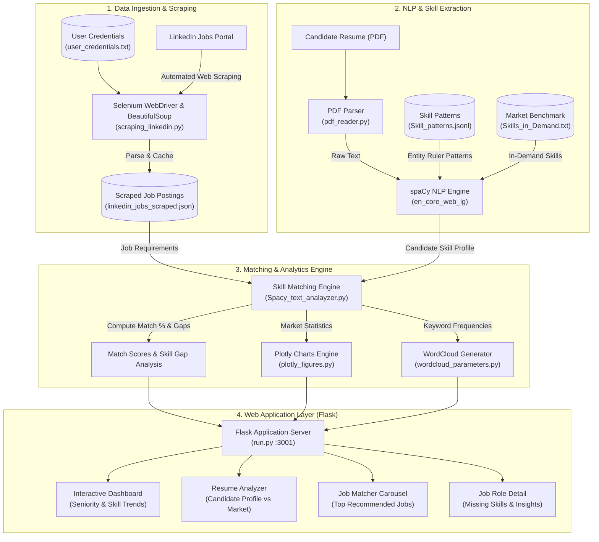
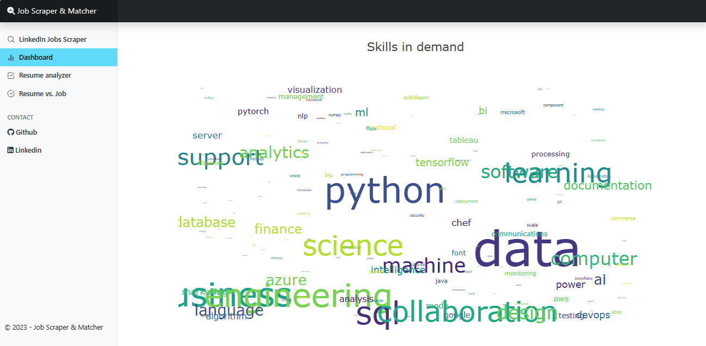
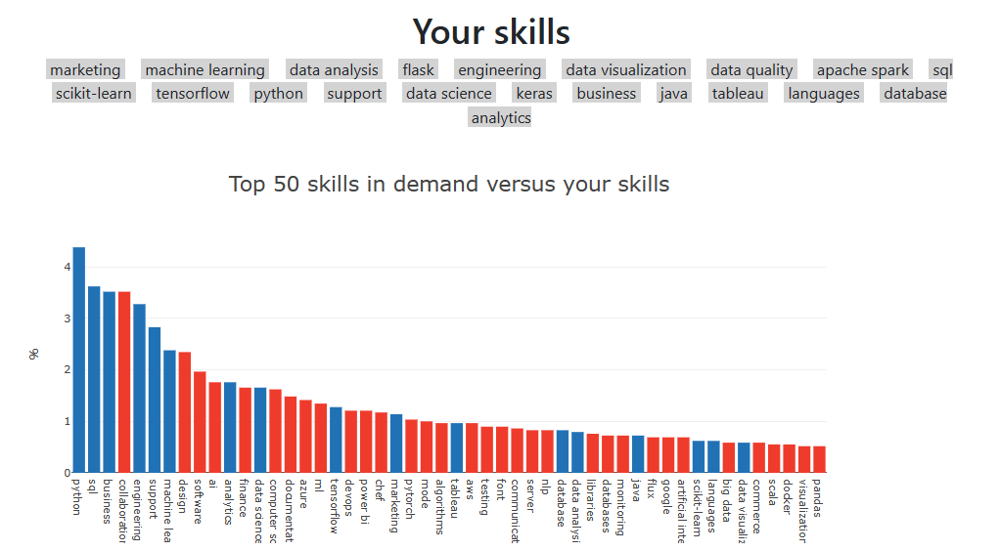
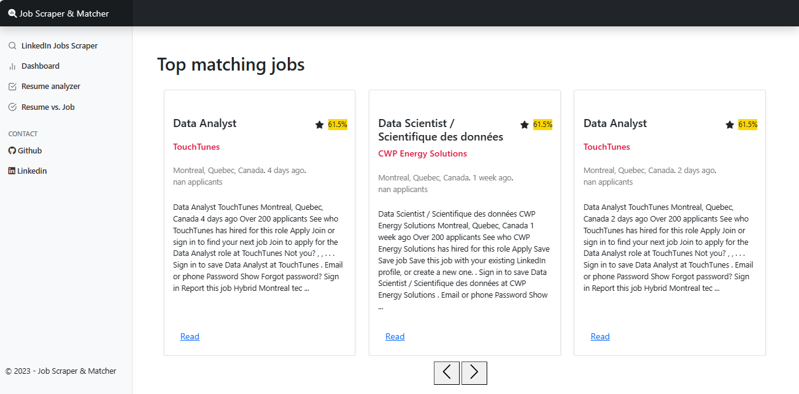
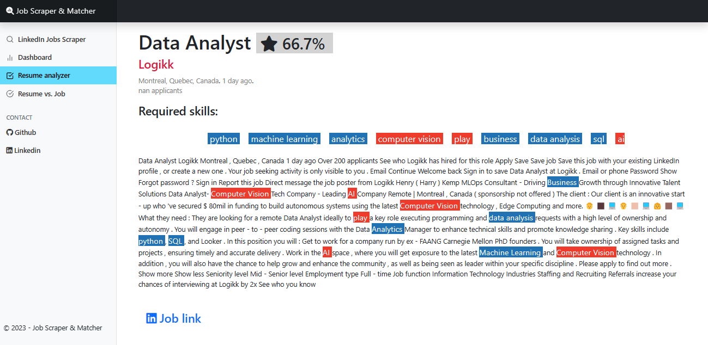

# TrendRadar

### WEB scraping with Selenium and BeautifulSoup, NLP with Spacy and WEB app with Flask

<div align="center">
  
</div>

### Table of Contents

1. [Project Motivation](#motivation)
2. [System Architecture](#architecture)
3. [Installation & Setup](#installation)
4. [File Descriptions](#file_descriptions)
5. [Instructions](#instructions)
6. [Flask Application](#Flask_app)
7. [REST API Endpoints](#api_endpoints)
8. [Acknowledgements](#Acknowledgements)

## Project Motivation <a name="motivation"></a>

If you're looking for a job, say a data science role, you're probably using Linkedin Jobs.
But with hundreds of jobs posted every day, it can be hard to find the ones that best match your skills.

The main purpose of this project is to help you find the best matching jobs automatically.

In this project we:

1. Built a Linkedin job scraper using `Selenium`, `Requests` and `BeautifulSoup`.
2. Built a text analysis of your resume and LinkedIn jobs using `Spacy`.
3. Developed a `Flask` app to display data visualisations, including a word cloud of in-demand skills. The app highlights job-specific skills and keywords, compares them to your skills and generates a list of the most relevant job matches.

## System Architecture <a name="architecture"></a>

The architecture of TrendRadar is structured into four primary modular pipelines:



### Architecture Workflow
- **Data Ingestion Tier**: Headless Selenium automation scrapes real-time LinkedIn job listings based on role, location, and seniority, caching structured JSON datasets locally.
- **NLP & Extraction Pipeline**: A large spaCy English pipeline (`en_core_web_lg`) coupled with custom Entity Ruler pattern matching maps technical and domain competencies across both resumes and job descriptions.
- **Matching & Analytics Engine**: The system computes semantic skill overlap, match scores, and missing skill gaps, feeding statistical aggregations into Plotly and WordCloud visualizations.
- **Flask Presentation Layer**: An interactive Bootstrap 5 frontend renders dashboards, visualizes skill gaps, and presents personalized ranked job matches.

## Installation & Setup <a name="installation"></a>

### 1. Requirements
This project requires Python 3.9+ and dependencies specified in `requirements.txt`:
- **Web Scraping**: `Selenium` (Selenium Manager auto-resolves ChromeDriver), `Requests`, `BeautifulSoup4`
- **NLP & Analysis**: `Spacy` (requires `en_core_web_lg`), `NLTK`
- **Web Application & Visuals**: `Flask`, `flask-cors`, `Plotly`, `Matplotlib`, `Wordcloud`
- **Environment**: `python-dotenv`

Install the dependencies:
```bash
pip install -r requirements.txt
```

Install the trained English NLP pipeline from spaCy:
```bash
python -m spacy download en_core_web_lg
```

### 2. Configuration & Credentials
You can configure credentials using either an environment file (recommended) or a credentials text file:

- **Option A (Recommended - `.env`)**:
  Copy `.env.example` to `.env` and fill in your details:
  ```bash
  LINKEDIN_EMAIL=your_email@example.com
  LINKEDIN_PASSWORD=your_password_here
  FLASK_PORT=3001
  ```
- **Option B (`data/user_credentials.txt`)**:
  Add your LinkedIn email and password on two separate lines in `data/user_credentials.txt` (see `data/user_credentials.example.txt`).

*Note: Automated logins automatically cache session cookies in `data/linkedin_cookies.json` to prevent repeated logins and bot checkpoints.*

## File Descriptions <a name="file_descriptions"></a>

- **FLASK_app** folder: contains our responsive Flask WEB application & REST API.
  - `run.py`: main file to run the web application and API endpoints.
  - `scraping_linkedin.py`: Automated LinkedIn scraper using Selenium (with cookie persistence & auto-driver resolution), Requests, and BeautifulSoup.
  - `Spacy_text_analayzer.py`: Code to analyse text with `Spacy`, search for keywords and skills, compare them with your own and return the most relevant job matches.
  - `plotly_figures.py`: Returns the configuration (data and layout) of `Plotly` figures.
  - `templates` folder: Contains 9 html pages.
  - `static` folder: Contains customized `CSS` file and `Bootstrap` bundles.
- **data** folder: contains the following files:
  - `user_credentials.example.txt`: Template for LinkedIn credentials.
  - `Skills_in_Demand.txt`: List of in-demand skills benchmark.
  - `Skill_patterns.jsonl`: Skill entity patterns used for the spaCy Entity Ruler.
  - `Job_Ids.csv` and `linkedin_jobs_scraped.json`: Scraped LinkedIn job IDs and structured job details.
- **notebooks** folder: contains exploratory data analysis notebooks.
- **resume** folder: Place your resume (PDF format) here for offline testing.

## Instructions <a name="instructions"></a>

1. Configure your LinkedIn credentials in `.env` or `data/user_credentials.txt`.

2. Run the scraper from the `FLASK_app` directory:
   ```bash
   python scraping_linkedin.py "data scientist" "Montreal, Quebec, Canada" 120
   ```
   - Replace `"data scientist"` and `"Montreal, Quebec, Canada"` with your desired title and location.
   - `120` is the page load wait timer in seconds (adjust depending on network speed).

3. Start the Flask application / API server:
   ```bash
   python run.py
   ```

4. Navigate to <http://127.0.0.1:3001/>

## Flask application <a name="Flask_app"></a>

1. The `Dashboard` page displays the distribution of seniority level and the number of days since the job posting. Additionally, it showcases a word cloud containing in-demand skills. This will help you define what you should be looking for to further broaden your skills.

   

2. The `Resume_Analyzer` page uploads your resume (pdf format), displays your skills and assesses them against the most in-demand skills.

   

3. The best matching jobs are showcased within a carousel that emphasises the matching scores.

   

4. The LinkedIn job role is presented on the `display_Job` page with an emphasis on the match score and highlighting essential skills required for the position that are not listed in your resume.

   

## REST API Endpoints <a name="api_endpoints"></a>

TrendRadar features a built-in RESTful JSON API with CORS support, making it seamless to connect React, Vite, or external frontend clients:

| Method | Endpoint | Description |
| :--- | :--- | :--- |
| `GET` | `/api/health` | Service health status and database statistics |
| `GET` | `/api/jobs` | Query scraped jobs with optional `?q=title/company` and `?level=level` |
| `GET` | `/api/trends` | Market skill frequencies and seniority level distribution |
| `POST` | `/api/analyze-resume` | Upload a PDF resume (`multipart/form-data`) or send JSON text to extract skills and match jobs |
| `POST` | `/api/match` | Match candidate skills (`skills: [...]`) against a job description (`job_description`) |
